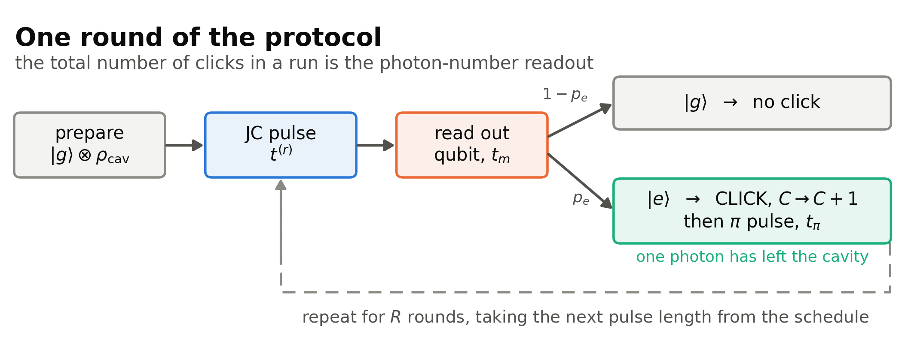
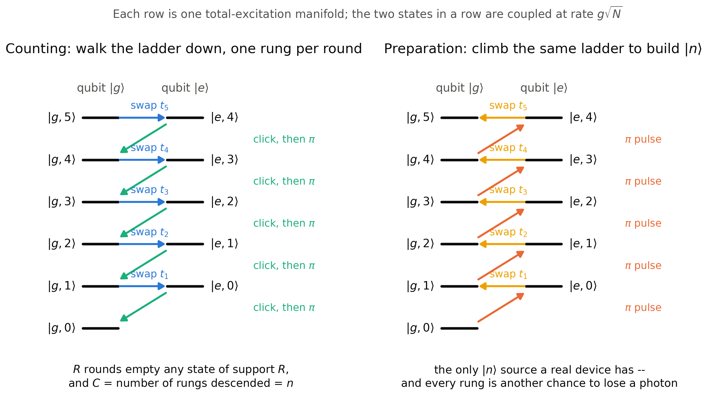
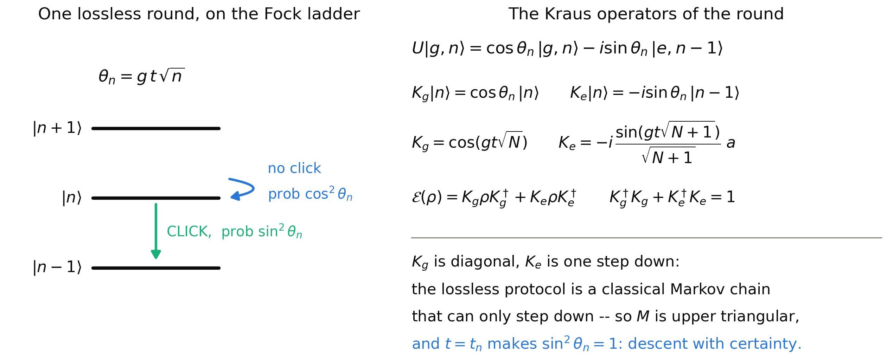
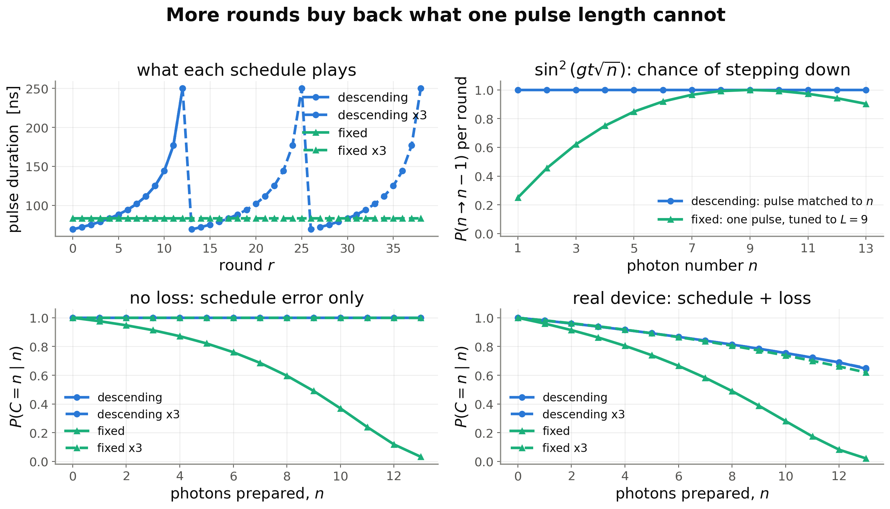
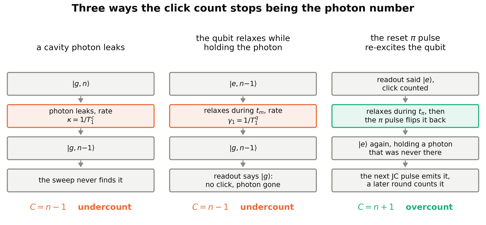
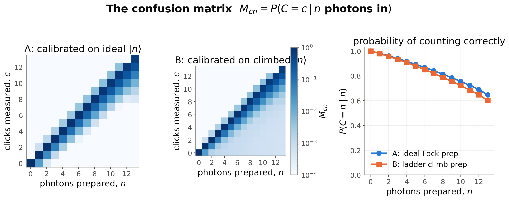
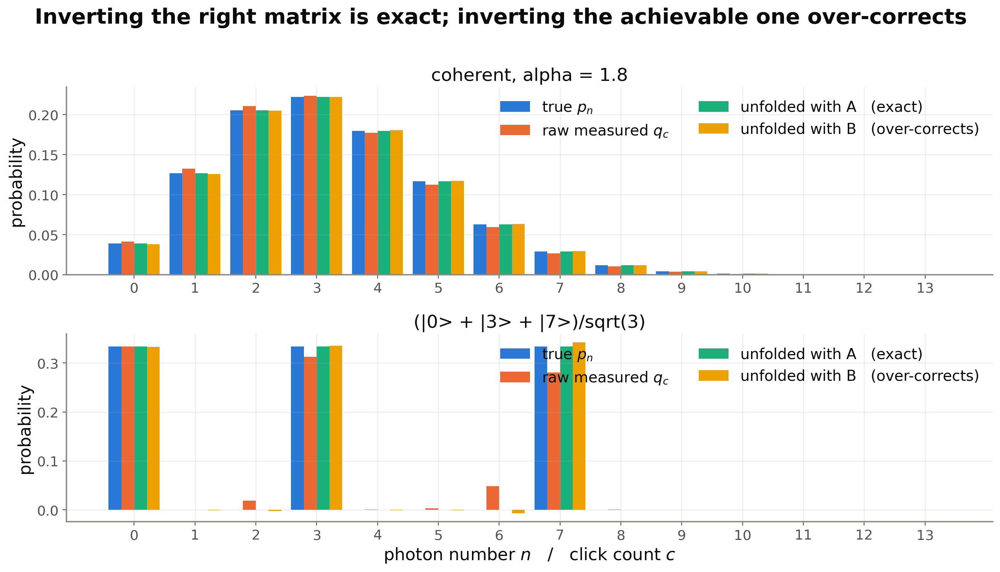

# Photon counting with a lossy machine

**Slide-ready summary of [`jc_counting_confusion_matrix.ipynb`](jc_counting_confusion_matrix.ipynb).**

Every figure is drawn at 16:9 slide proportions with presentation-scale type, and is available as
both PNG and SVG in [`jc_counting_figs/`](jc_counting_figs/) — drop the SVG into PowerPoint for
crisp scaling. Every number below is produced by the notebook itself; the figure script re-runs the
notebook's code rather than copying results, so the two cannot drift apart.

---

## 1. The protocol

A qubit is used as a photon counter. Each **round** swaps one photon out of the cavity and onto the
qubit, reads the qubit out, and resets it. The number of $|e\rangle$ outcomes in a run — the **click
count** $C$ — is the photon-number readout.

The Jaynes–Cummings Hamiltonian $H = g(\sigma_+ a + \sigma_- a^\dagger)$ couples only the pairs
$\{|g,n\rangle, |e,n-1\rangle\}$, which are degenerate in the rotating frame. So the whole protocol
lives on a ladder of two-state manifolds, and a run walks down it.

The right-hand panel is the same ladder run backwards. That is not a decoration: climbing the ladder
is the only way a real device can *prepare* a Fock state, and section 5 shows what that costs.

---

## 2. Why one pulse length cannot work — the Kraus operators

Within manifold $n$ the Hamiltonian reduces to $g\sqrt{n}\,\sigma_x$, so a pulse of duration $t$ gives
$U|g,n\rangle = \cos\theta_n |g,n\rangle - i \sin\theta_n |e,n-1\rangle$ with $\theta_n = gt\sqrt{n}$.
Reading off the two measurement branches gives the cavity Kraus operators of one lossless round.

The structural fact is that **$K_g$ is diagonal and $K_e$ is one step down**. A lossless run is
therefore exactly a classical Markov chain on photon number that can only descend:

$$P(n \to n-1) = \sin^2(gt\sqrt{n}) \ \ \text{(click)}, \qquad P(n \to n) = \cos^2(gt\sqrt{n})$$

This settles the schedule question in one line. The $\sqrt{n}$ means no single pulse length steps
every level down with certainty — but $t = t_n \equiv \pi/2g\sqrt{n}$ makes $\sin^2\theta_n = 1$ for
level $n$ exactly. Verified against the full simulation:

| check | result |
|---|---|
| completeness $K_g^\dagger K_g + K_e^\dagger K_e = \mathbb{1}$ | $1.1\times10^{-16}$ |
| Kraus channel vs. full Liouvillian simulation (ideal machine, all schedules) | $\le 5.6\times10^{-16}$ |

---

## 3. The schedules

Two families, each run for one pass ($R = 13$ rounds) and for three ($39$ rounds).

- **`descending`** — pulses tuned to levels $R, R-1, \dots, 1$, i.e. *short pulses first, lengthening*.
  Walks the ladder down one rung per round and empties a state of support $R$ in exactly $R$ rounds.
- **`fixed`** — the same pulse every round, tuned to level $L =$ `FIXED_LEVEL` $= 9$. The simplest
  thing to build, and it cannot swap every level.

**More rounds buy back what pulse shaping cannot.** The fixed schedule was never fundamentally blind —
every round has a decent chance of knocking any level down a rung — it was just impatient:

| schedule | rounds | run time | $\lVert M_{\text{no loss}} - \mathbb{1}\rVert$ | $\langle n\rangle$ left (no loss) | cond $M$ |
|---|---|---|---|---|---|
| `descending`    | 13 | 17.7 µs | $6.7\times10^{-16}$ | $1.2\times10^{-18}$ | 2.0 |
| `descending x3` | 39 | 53.2 µs | $6.7\times10^{-16}$ | $6.7\times10^{-56}$ | 2.0 |
| `fixed`         | 13 | 17.3 µs | $0.97$              | $0.114$             | 301.6 |
| `fixed x3`      | 39 | 52.0 µs | $1.2\times10^{-3}$  | $6.5\times10^{-5}$  | 2.2 |

Tripling the rounds turns the worst schedule into a usable one. Repeating an *already exact* sweep
buys almost nothing, because after the first pass the cavity is empty and the extra rounds have no
photons left to act on — `descending x3` cools further ($5\times10^{-5} \to 3\times10^{-15}$ on the
real device) but its confusion matrix is unchanged to three digits. The extra rounds are not free:
three times the $\pi$ pulses means three times the overcounting channel below.

---

## 4. What loss does

Coherence times and gate times used throughout: $T_1^q = 200$ µs, $T_2^q = 80$ µs, $T_1^c = 300$ µs,
$T_\phi^c = 800$ µs, $t_\pi = 150$ ns, $t_m = 1.1$ µs, $g/2\pi = 1$ MHz, cavity truncated at $N = 14$.

The third mechanism is worth stating carefully, because it is the only one that makes the counter
*over*count and it is easy to miss. The reset $\pi$ pulse fires **unconditionally** whenever the
readout says $|e\rangle$. If the qubit relaxes during the $t_\pi$ window — after the measurement,
before the pulse — the $\pi$ pulse puts it *back* into $|e\rangle$. The qubit now carries an excitation
that never came from the cavity; the next JC pulse emits it into the cavity as a real photon, and a
later round counts it a second time. It scales as $t_\pi/T_1^q$ and switches off **identically** at
$t_\pi = 0$:

| largest $M_{cn}$ with $c > n$ | value |
|---|---|
| device, $t_\pi = 150$ ns | $4.9\times10^{-3}$ |
| same device, $t_\pi = 0$ | $0$ exactly |

---

## 5. The confusion matrix, and the calibration problem

$$M_{cn} = P(C = c \mid n \text{ photons in}), \qquad q = Mp$$

Because every element of the protocol commutes with the total-excitation rotation, the response
depends **only** on the photon-number populations $p_n$ — checked numerically at
$\max|p(\rho) - p(\text{diag}\,\rho)| = 0$ exactly. That symmetry is what licenses describing the whole
apparatus by one matrix.

Two ways to calibrate it, and only one of them is available in a lab:

- **A — ideal Fock prep.** Column $n$ is the response to a perfect $|n\rangle$. Contains only the
  counter's errors.
- **B — ladder-climb prep.** Column $n$ is the response to $\rho_{\text{prep}}(n)$, built by climbing
  the ladder under the same decoherence. Contains preparation errors *and* counting errors, and cannot
  tell them apart. At $n = 13$ the climb delivers only $\langle 13|\rho_{\text{prep}}|13\rangle = 0.93$.

---

## 6. Unfolding: $\hat p = M^{-1} q$

| descending schedule, real device | TVD from truth | $\langle n \rangle$ |
|---|---|---|
| true $p_n$ (coherent, $\alpha = 1.8$) | — | 3.2400 |
| raw measured $q_c$ | $1.5\times10^{-2}$ | 3.1736 |
| unfolded with **A** (ideal prep) | $\mathbf{1.7\times10^{-16}}$ | **3.2400** |
| unfolded with **B** (climb prep) | $2.8\times10^{-3}$ | 3.2539 |

**Inverting the right matrix is exact.** The residual is round-off and nothing else — for every
schedule, including ones that never cool the cavity, because a bad schedule is just a different linear
map, not a broken one. The forward statement $q = Mp$ checks against a full independent simulation of
the coherent state at $\le 1.7\times10^{-16}$ for all four schedules: the matrix *is* the apparatus,
not a fit to it.

**Inverting the achievable matrix over-corrects.** Calibration B was built on states that were already
missing photons, so it credits the detector with preparation loss and hands back too much probability
at high $n$ — landing on the far side of the truth from the raw data. The bias operator
$M_{\text{climb}}^{-1}M_{\text{ideal}} - \mathbb{1}$ has max entry $0.074$, and B reports
$\langle n\rangle = 13.12$ for a true $|13\rangle$.

This is the one experimentally load-bearing caveat in the whole notebook. The exactness of A is a
consistency check on the simulation, not a lab result — nobody has an ideal Fock source.

---

## 7. Finite statistics

At $2\times10^4$ shots, with $\text{Cov}(\hat p) = M^{-1}\text{Cov}(\hat q)M^{-\mathsf T}$:

| schedule | cond $M$ | realised amplification | TVD raw | TVD $M^{-1}$ | TVD nnls | most negative bin |
|---|---|---|---|---|---|---|
| `descending`    | 2.0   | 0.9× | 0.0150 | 0.0058 | 0.0058 | $+8\times10^{-5}$ |
| `descending x3` | 2.0   | 0.9× | 0.0196 | 0.0068 | 0.0068 | $-0$ |
| `fixed`         | 301.6 | 1.0× | 0.0389 | 0.0093 | 0.0087 | $-3.9\times10^{-4}$ |
| `fixed x3`      | 2.2   | 0.9× | 0.0157 | 0.0118 | 0.0118 | $-0$ |

The condition number is a worst-case bound over every direction in $q$, and a real measurement rarely
points along the worst one — here even `fixed` realises only $1.0\times$ the raw shot noise. **A large
cond$(M)$ is a warning about what could go wrong, not a measurement of what did.** What does show up
is the negative bins it predicts, cured by a non-negative fit (`scipy.optimize.nnls`). Keeping the
schedule well conditioned remains cheap insurance, since nothing guarantees the next state points in a
harmless direction.

---

## Suggested slide split

| slide | figures | one-line message |
|---|---|---|
| 1 | `protocol_round`, `ladder` | clicks count photons, by walking a ladder down |
| 2 | `kraus` | $K_g$ diagonal, $K_e$ one step down ⇒ a Markov chain, and $t_n$ makes descent certain |
| 3 | `schedules` | more rounds buy back what one pulse length cannot |
| 4 | `error_mechanisms` | two ways to undercount, one way to overcount |
| 5 | `confusion_matrices`, `unfolding` | invert the right matrix and it is exact; invert the achievable one and it over-corrects |
